# MPLS Network Server Configuration

## Key Achievements

- Designed and implemented a complete MPLS network simulation using GNS3 and Cisco router images.
- Planned and optimized IP addressing and subnetting for both MPLS core and external networks.
- Configured OSPF routing, MPLS Traffic Engineering (TE), and MPLS VPN features.
- Deployed and verified static MPLS TE tunnels with explicit paths.
- Implemented Fast Reroute (FRR) for high availability and rapid failover.
- Applied troubleshooting techniques using advanced Cisco IOS commands.

---

In this project, I describe how I set up an MPLS network server, including OSPF static routing, MPLS Traffic Engineering with QoS, and MPLS VPN. For the simulation, I used GNS3 with Cisco C3600 and C7200 router images.

## Network Topology

I configured the network topology as shown below:

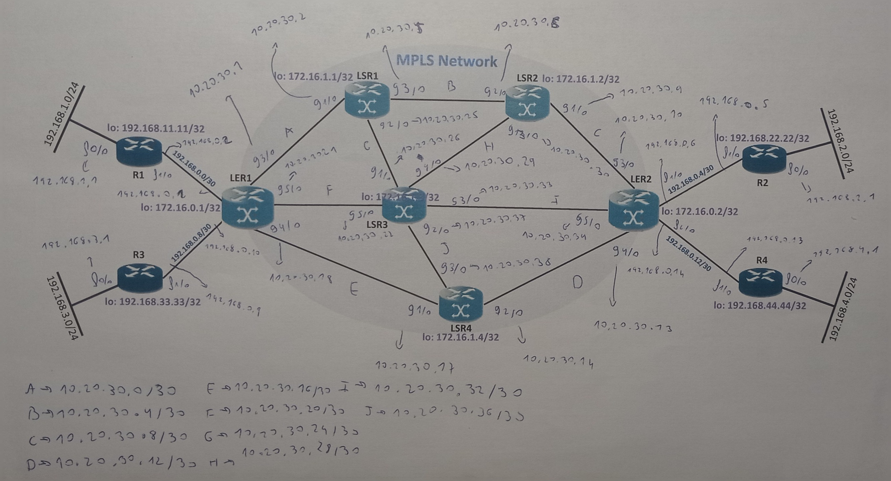

## IP Addressing and Subnet Planning

I divided the IP addressing into two main areas:
- **Inside the MPLS network:** I used the range `10.20.30.0/23`.
- **Outside the MPLS network:** I used the range `192.168.0.0/24`.

I carefully planned the subnetting to optimize address usage and avoid wasting IPs.

### Subnetting Inside the MPLS Network

For each inter-router link within the MPLS network, I assigned a dedicated subnet with the mask `255.255.255.252`. This is ideal because only two IP addresses are needed for the routers, plus the network and broadcast addresses.

### Subnetting Outside the MPLS Network

Outside the MPLS network, I also used the `255.255.255.252` mask for inter-router connections. At the network edges, where end devices connect, I used the subnet mask `255.255.255.0`.

---

## GNS3 Implementation

After planning the addressing, I started building and configuring the topology in GNS3.

First, I added 4 Ubuntu Docker guests, 6 Cisco 7200 routers (for MPLS), and 4 Cisco 3600 routers (for the external network). I created the necessary interfaces for each router, making sure to use gigabit ethernet interfaces inside the MPLS network and fast ethernet interfaces outside.

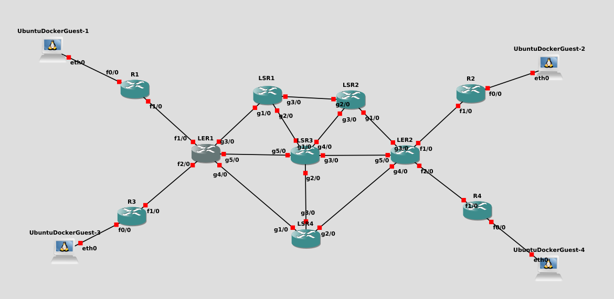

Once the topology was complete, I began configuring each device. I started from the outside and worked towards the center, beginning with the Ubuntu Docker guests:

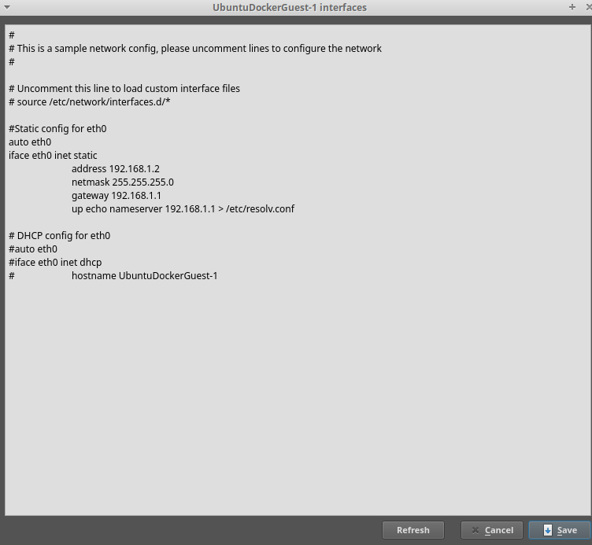

Next, I configured IP addresses and routes on the non-MPLS routers:

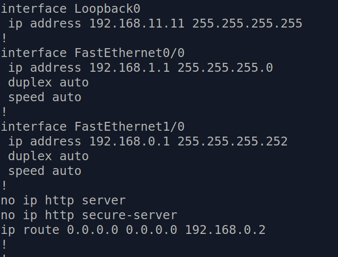

#### Troubleshooting

During this phase, I verified connectivity using `ping` and `traceroute` between all links to ensure everything worked as intended. If any issues appeared, I checked the routing tables and the IP addresses assigned to the interfaces that were not working properly. The main commands I used were:

- `show run`
- `traceroute`
- `ping`
- `show ip route`

---

After assigning IP addresses and setting up routing, I configured the LSR and LER routers with OSPF (in the same area) and static IP addresses. I also configured the loopbacks for the MPLS setup:

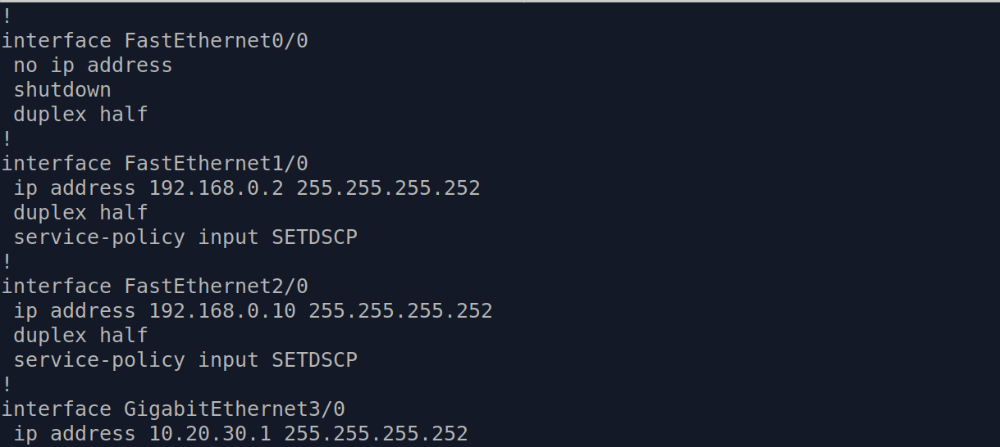
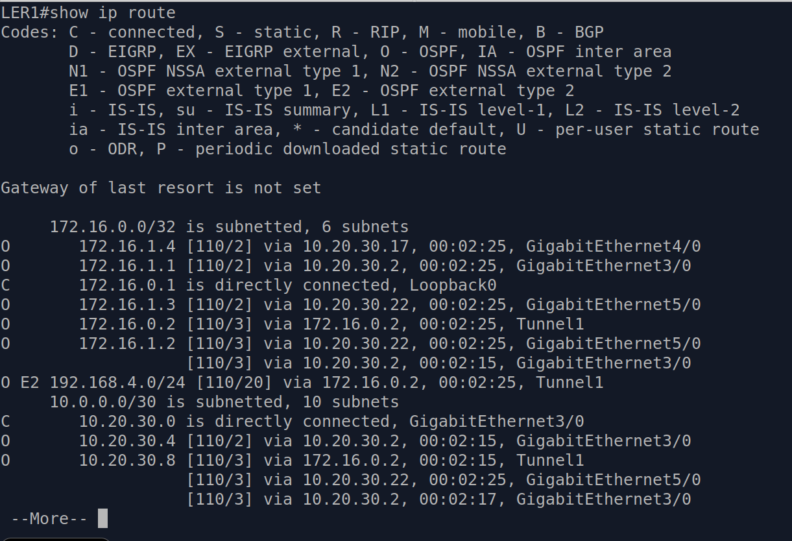

#### Troubleshooting

At this stage, I checked OSPF neighbor relationships and verified that all routers had the correct routes. If I found any issues, I used commands like:

- `show ip ospf neighbor`
- `show ip route`
- `show ip interface brief`

---

## MPLS and Traffic Engineering Configuration

Once basic connectivity was established, I enabled MPLS on the six Cisco 7200 routers. Both LERs act as ingress and egress routers in this topology. I used Label Distribution Protocol (LDP) to exchange label bindings between MPLS routers.

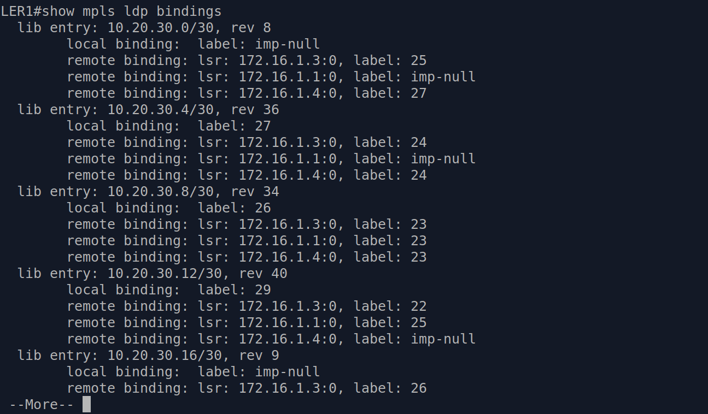

#### Troubleshooting

To verify MPLS operation, I used:

- `show ip cef` (to see the FIB)
- `show mpls interfaces`
- `show mpls ldp bindings`

These commands helped me identify and fix any MPLS label or interface issues.

---

After MPLS was working, I configured two static MPLS TE tunnels. The first tunnel follows the path: LER1-LSR4-LER2, while the second follows: LER2-LSR2-LSR1-LER1. I set up both tunnels using explicit paths.

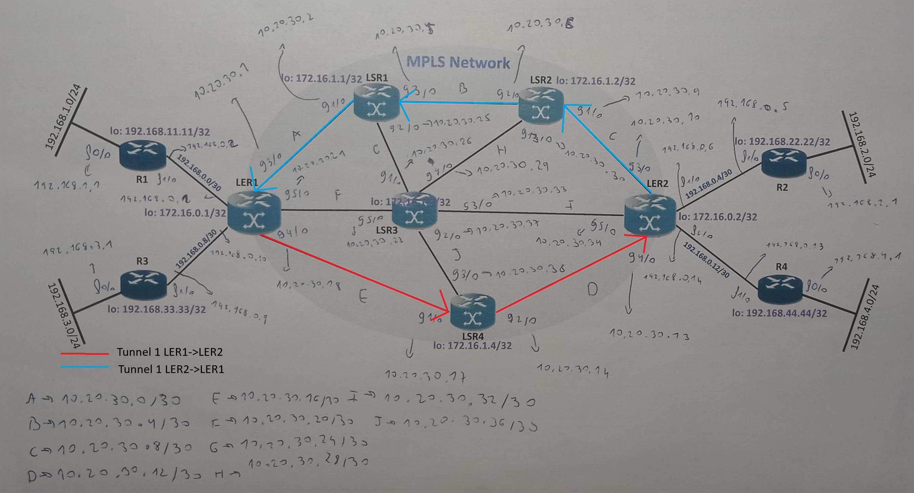
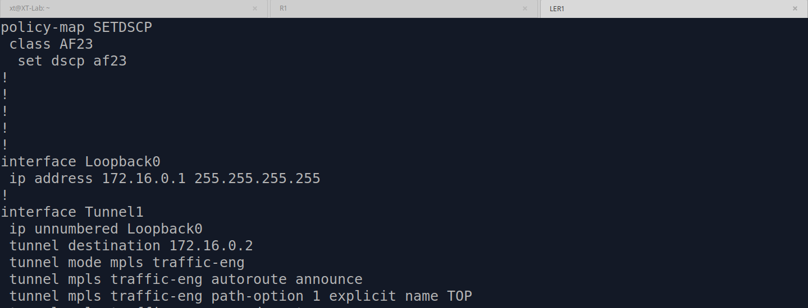
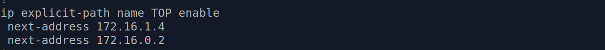

#### Troubleshooting

As with every step, I tested the network and looked for errors. For the tunnels, I mainly used:

- `ping mpls traffic-eng tunnel tunnel-number`
- `traceroute mpls traffic-eng tunnel tunnel-number`
- `show mpls traffic-eng tunnels summary`
- `show mpls interfaces`
- `show ip explicit-paths name <name-of-the-path>`

After confirming that everything was working properly, as shown in the traceroutes below, I decided to implement local protection mechanisms such as FRR for these tunnels.

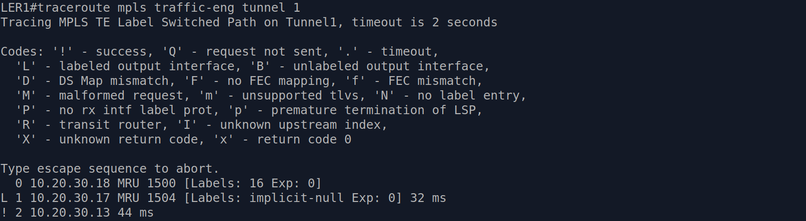
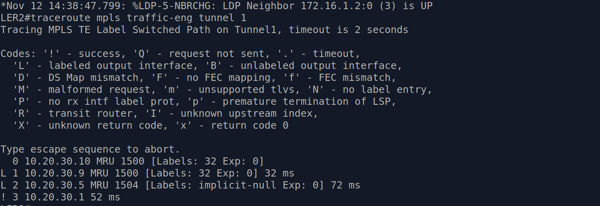

## FRR

In this topology, I configured local protection for several links using Fast Reroute (FRR), which is a pre-signaled backup tunnel. If the original tunnel link fails, the backup tunnel is activated to ensure traffic can still reach its destination.

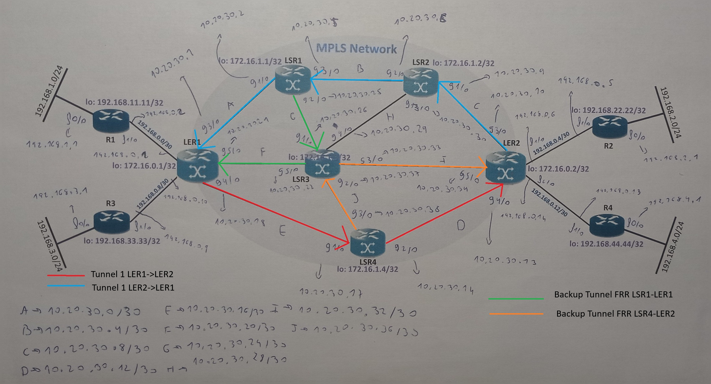

To achieve this, I configured RSVP (Resource Reservation Protocol) using the command `ip rsvp signalling hello` globally in the router configuration mode and on the interfaces I wanted to protect. After that, I created backup tunnels, assigned explicit paths, and notified the LERs about fast reroute and record reroute.

To verify that the backup tunnels were working properly, I simulated a link failure and ran `traceroute mpls` to confirm the reroute, as shown in the images below.

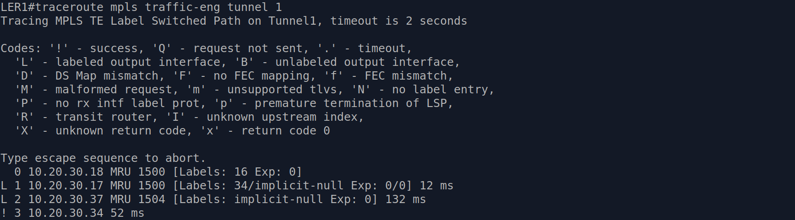

QoS and MPLS VPN configuration is in progress...
